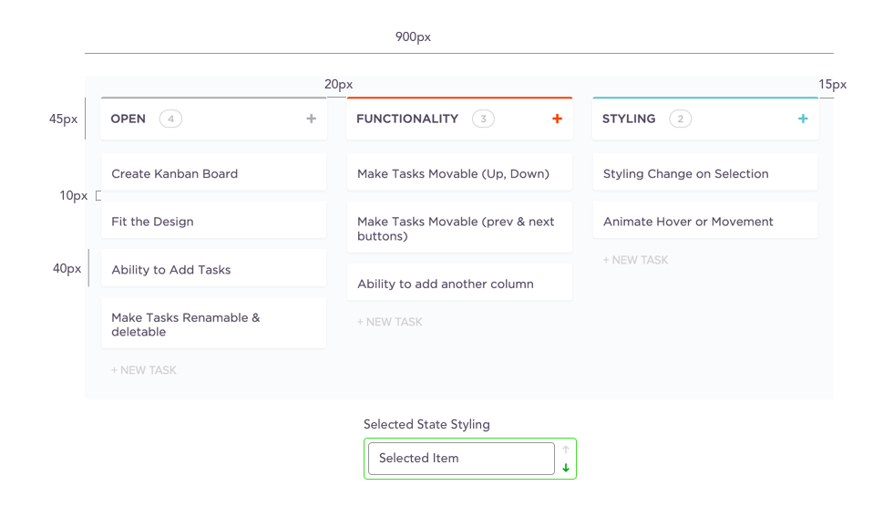

# Kanban Board Development

This is a task to create a basic kanban board.

Use what ever framework/tool you want to create this. Ideally you can create it in https://codesandbox.io/ so that we can easily look over it.

A Kanban board is a tool that lets you put tasks/todos into different stages of completion. Generally teams move tasks from backlog/open -> In Progress -> Code Review -> Completed.

The image above shows you the requirements for this task:

Everything in open:
1. Create Kanban Board
2. Fit the Design
3. Ability to Add Tasks
4. Make Tasks Renamable and Deletable.
5. Ability to move from one board to the next (Use Prev and Next Buttons)

Select One or More Extra Functionality
1. Ability to reorder Tasks
2. Option to add another column

Select One or more of the Styling
1. Add Styling change to selection (Add Styling)
2. Animate hover (Show options when item is hovered)

Anything else you think is an improvement/would like to impress us with.
Do what you can in about an hour. 

